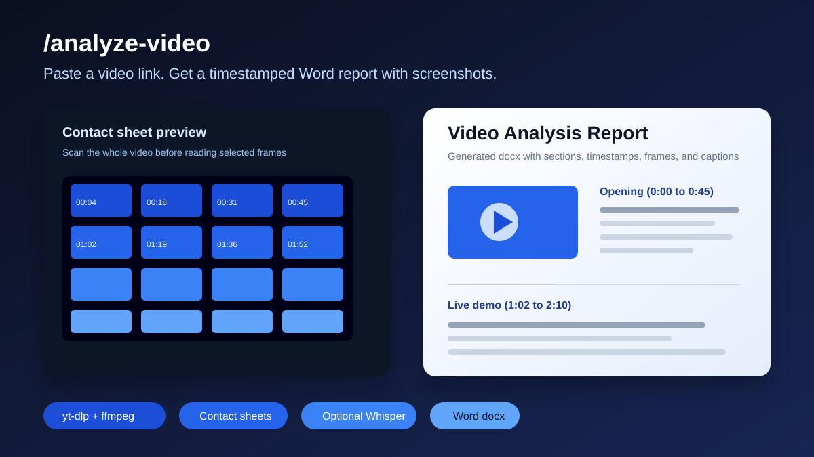

# 🎬 /analyze-video

[](https://github.com/evillollive/Analyze-Video-Skill/actions/workflows/ci.yml)
[](https://github.com/evillollive/Analyze-Video-Skill/releases)
[](LICENSE)

**Paste a video link. Get a timestamped Word report with screenshots, captions, and concrete visual analysis.**

`/analyze-video` is a Claude Code skill for turning YouTube, Vimeo, TikTok, X, Twitch, and local videos into polished `.docx` reports. It uses [yt-dlp](https://github.com/yt-dlp/yt-dlp), ffmpeg, contact sheets, optional Whisper transcription, and a guarded, token-efficient frame-selection workflow.



## Why people use it

- **Video to report:** drop in a URL or local file and get a structured Word document.
- **Screenshots included:** reports embed selected frames with descriptive captions, one per row or two-up side by side.
- **Timestamped analysis:** transcript evidence and visuals are organized by time range.
- **Token efficient:** contact sheets let the AI scan the whole video before reading only the important frames.
- **Long-video ready:** runs can resume, reuse extracted frames, reuse cached downloads, and emit progress files.
- **Accessible output:** embedded frames and contact sheets carry required alt text for screen readers.
- **Privacy-aware:** video processing is local; audio only leaves the machine if optional Whisper fallback is enabled.

Each document is named after the video plus the word `analysis` (for example `how-to-bake-bread-analysis.docx`) and records the exact source link or file path it analyzed. Before building, the skill asks whether you want contact sheets and the full transcript appended inside the document, kept as standalone files next to it, and whether you want a PDF alongside the `.docx`.

## How it works

1. **Download or resolve** the source video with yt-dlp or a local path.
2. **Fetch captions** when available, or optionally transcribe audio with Whisper.
3. **Extract frames** at smart intervals.
4. **Build contact sheets** so the AI can preview many frames cheaply.
5. **Select representative frames** with timestamps and chunk awareness.
6. **Validate the docx spec** so stale frame/contact-sheet paths fail before build.
7. **Write the analysis** from visuals plus transcript evidence.
8. **Export a `.docx`** with embedded frames, captions, source metadata, and optional appendices/PDF.

One video or a whole batch works. Long videos are automatically chunked so the workflow stays manageable.

## The clever bits

### Contact sheets save tokens

Every frame the AI reads costs tokens. Instead of reading 100+ frames individually, the skill tiles frames into contact sheets. The AI scans those overviews, picks the frames that actually matter, and only reads those at full resolution.

### Unified workflow

`/watch` and `/analyze-video` are merged into one skill flow. One command handles setup, processing, frame selection, analysis, validation, and docx output.

### Accessible by default

Word documents are not accessible unless someone makes them so. This skill bakes it in: every embedded frame and contact sheet carries required alt text.

### Built for long videos

Big videos used to time out and restart from zero. Now the skill picks up where it left off: extracted frames are reused when the source and settings have not changed (pass `--force` to redo them), each extraction config gets its own directory, and `status.json` plus `manifest_partial.json` record progress. Downloaded videos are cached once per URL and reused across runs; the cache prunes itself by age and size. Repeated end-card promos or static outros can be detected and trimmed with `--trim-static-outro`. Want a faster, cheaper pass? `--quick` trims the frame budget and skips contact-sheet preview.

## Install in 60 seconds

Download the latest `analyze-video.skill` from the [releases page](https://github.com/evillollive/Analyze-Video-Skill/releases/latest), then install it through the Claude skill/plugin flow you use.

For Claude Code plugin usage from this repository:

```bash
git clone https://github.com/evillollive/Analyze-Video-Skill.git
cd Analyze-Video-Skill
python3 scripts/setup.py
```

The setup script checks or installs:

- Python 3.9+
- Node.js and npm
- ffmpeg and ffprobe
- yt-dlp
- the `docx` npm module used by the Word document builder
- optional LibreOffice support if you want PDF versions

Whisper keys are optional. Without a key, videos with native captions still get transcript-aware analysis, and captionless videos fall back to frames-only analysis.

To enable Whisper fallback for videos without captions:

```bash
python3 scripts/setup.py --set-key groq <YOUR_KEY>
# or:
python3 scripts/setup.py --set-key openai <YOUR_KEY>
```

Keys are stored in `~/.config/analyze-video/.env` with owner-only permissions.

## Try it

Ask naturally:

```text
Analyze this video and write me a report: https://youtu.be/abc
```

```text
Make a doc from these three videos with screenshots.
```

```text
Just look at the 2:30 to 3:15 section of this clip.
```

## Manual script workflow

You can also run the runtime directly:

```bash
python3 scripts/process.py \
  --source "/path/or/video-url" \
  --out-dir /tmp/analyze-video-demo
```

The command writes `manifest_lite.json`, `manifest.json`, contact sheets, selected-frame candidates, transcript files when available, and a pipeline report. Then generate frame picks:

```bash
python3 scripts/select_frames.py /tmp/analyze-video-demo/manifest_lite.json 10
```

Before building a Word document, validate the spec and lint its quality:

```bash
python3 scripts/validate_spec_paths.py /tmp/analyze-video-demo/spec.json
python3 scripts/lint_spec_quality.py /tmp/analyze-video-demo/spec.json
node scripts/build-docx.js --spec /tmp/analyze-video-demo/spec.json
```

For guarded end-to-end runs, see:

```bash
python3 scripts/run_guarded_pipeline.py --help
```

## Using it from GitHub Copilot App

GitHub Copilot App does not automatically load `SKILL.md` as a Claude skill, but the runtime works from a Copilot project session:

1. Clone or open this repository in the app.
2. Run `python3 scripts/setup.py`.
3. Ask Copilot to run the guarded pipeline or `scripts/process.py`, inspect manifests/contact sheets, select frames, write a JSON docx spec, validate it, and call `scripts/build-docx.js`.

A future native wrapper could expose this as a command or canvas UI for source input, progress, frame selection, and document download.

## What's in the box

```text
Analyze-Video-Skill/
├── SKILL.md                     # How Claude uses this skill
├── CHANGELOG.md                 # What changed and when
├── LICENSE                      # AGPL-3.0, always open source
├── commands/
│   └── analyze-video.md         # Slash-command definition
├── hooks/                       # Silent plugin hooks
├── scripts/
│   ├── process.py               # Main pipeline entry point
│   ├── download.py              # yt-dlp wrapper and failure classification
│   ├── cache_utils.py           # Self-pruning download + transcript caches
│   ├── frames.py                # Frame extraction and contact sheets
│   ├── transcribe.py            # VTT parser and deduper
│   ├── whisper.py               # Groq/OpenAI Whisper client
│   ├── env_utils.py             # Shared config reader
│   ├── setup.py                 # First-run installer and preflight checks
│   ├── host_env.py              # Host fingerprint and setup state helpers
│   ├── build-docx.js            # Word document renderer
│   ├── select_frames.py         # Frame selection helper
│   ├── validate_spec_paths.py   # Fails fast on stale/missing asset paths
│   ├── lint_spec_quality.py     # Spec structure/content quality guard
│   ├── run_guarded_pipeline.py  # Orchestrates setup, process, selection, and build gates
│   └── build-skill.sh           # Packages the .skill bundle
├── docs/
│   ├── SHARING.md               # Launch/share checklist and copy
│   └── assets/demo-preview.svg  # Lightweight visual preview
├── tests/                       # parsing, math, setup, guardrail, and security tests
└── templates/
    └── caption_guide.md         # Writing style guide for frame captions
```

## Privacy & security

Everything runs locally on your machine. Here's exactly what goes where:

**Stays on your computer:**

- The video file, extracted frames, contact sheets, manifests, and final `.docx`
- Your config at `~/.config/analyze-video/.env` with owner-only permissions
- Downloaded source videos cached at `~/.cache/analyze-video/downloads/`
- Whisper transcripts cached at `~/.cache/analyze-video/transcripts/`

The download cache manages itself: at the end of each run it evicts entries older than 14 days and trims total size back under 5 GB, least-recently-used first. It never removes a download an active run is using. Tune limits with `ANALYZE_VIDEO_CACHE_MAX_AGE_DAYS` and `ANALYZE_VIDEO_CACHE_MAX_GB` (set either to `0` to disable that limit), or wipe the cache with:

```bash
python3 scripts/setup.py --clear-cache
```

Transcripts are cached too, because transcribing is the most expensive non-download step: it decodes the whole video's audio, uploads it, and pays for a Whisper API call. A repeat run on the same video and range reuses the stored result and skips all three. Entries are keyed by the source file's identity plus the requested range and backend/model, so a re-downloaded or edited video always re-transcribes. They are tiny, so they are kept for 90 days (`ANALYZE_VIDEO_TRANSCRIPT_CACHE_MAX_AGE_DAYS`, `0` to disable) and cleared by `--clear-cache` along with the downloads. Use `--force` to re-transcribe and overwrite the entry, or `--no-download-cache` to keep a run fully self-contained.

**Sent to an API only when needed:**

- Extracted audio to Groq or OpenAI Whisper, only when captions are missing and you configured a key

**Never by default:**

- Source video upload
- Platform login
- Cookie access
- Posting or account mutation

### When a site blocks the download

Some sites block unauthenticated download tools with login prompts, bot checks, age gates, members-only access, rate limits, or regional restrictions. The skill classifies those failures and gives a specific next step instead of repeatedly retrying. For public YouTube links it also tries the android player client first before falling back to the default client.

If you can already watch the video in your own browser and want the skill to use that authorized session, retry with one of yt-dlp's cookie options:

```bash
python3 scripts/process.py --source "<url>" --out-dir /tmp/video \
  --cookies-from-browser safari
```

or:

```bash
python3 scripts/process.py --source "<url>" --out-dir /tmp/video \
  --cookies /path/to/cookies.txt
```

The skill should not spoof watch sessions, forge tokens, or automate hidden browser playback to bypass bot detection. If browser cookies are not appropriate, download or screen-record the video yourself and pass the local file path.

Note that `--cookies-from-browser` only works when yt-dlp runs on the same machine and OS as the browser. If you're running the skill in a sandbox or remote environment, it cannot read your local browser cookie store, so run the download host-side and pass the resulting local file. If you already downloaded a video this way and it lost captions, recover the transcript without re-downloading:

```bash
python3 scripts/process.py --captions-only --source "<url>" --out-dir /tmp/video
```

## Help share it

If this is useful, star the repo, share the [latest release](https://github.com/evillollive/Analyze-Video-Skill/releases/latest), or use the launch copy and checklist in [`docs/SHARING.md`](docs/SHARING.md).

Good search phrases for people who need this:

- analyze YouTube videos with Claude
- AI video to Word report
- timestamped video analysis with screenshots
- Claude Code video analysis skill
- yt-dlp Whisper docx video report

## Contributing

Found a bug? Have an idea? PRs and issues are welcome.

## License

[AGPL-3.0](LICENSE). This project will always be open source. Fork it, improve it, share it. Just keep it open.
